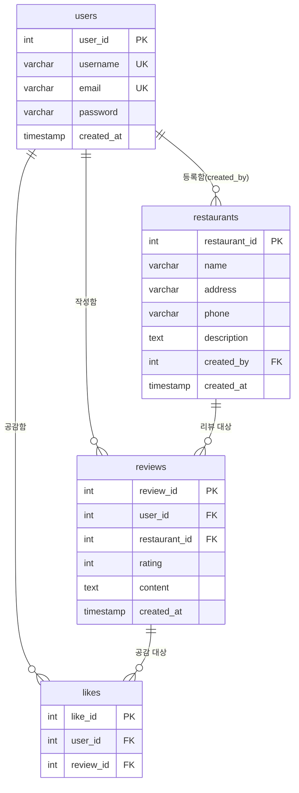

# 🥩 돈가스짱 (dongasjjang)

> 인생 돈가스 맛집을 찾는 쩝쩝박사들을 위한 돈가스 맛집 커뮤니티

돈가스 맛집을 등록하고, 방문 후기를 남기고, 다른 사람들의 리뷰에 공감(좋아요)을 표시할 수 있는 웹 서비스입니다.

---

## 📌 주요 기능

- **돈가스 맛집 등록**: 매장명, 주소, 전화번호를 입력해 새로운 돈가스집을 등록
- **시식 리뷰 작성**: 방문한 매장을 선택하고 평점(1~5점)과 상세 후기를 등록
- **리뷰 공감(좋아요)**: 다른 유저의 리뷰에 공감 버튼으로 반응
- **맛집 지도 현황**: 등록된 모든 매장과 리뷰를 한눈에 조회

---

## 🛠 기술 스택

| 구분 | 내용 |
|------|------|
| Frontend | HTML5, CSS3(Vanilla), JavaScript(Vanilla) |
| Backend(DB) | MySQL |
| 데이터 저장 | (현재 프로토타입) 브라우저 메모리 내 임시 배열 → 추후 DB 연동 예정 |

> 현재 제공된 `index.html`은 실제 DB와 연결되지 않은 **프론트엔드 프로토타입**이며, 내부 JS 배열(`db_restaurants`, `db_reviews`, `db_likes`)로 데이터를 임시로 흉내 내고 있습니다. 아래 ERD/스키마를 기준으로 백엔드 API와 연동하면 실제 서비스로 확장할 수 있습니다.

---

## 🗂 데이터베이스 구조 (ERD)



**관계 설명**
- `users` 1 : N `restaurants` — 한 유저가 여러 매장을 등록할 수 있음
- `users` 1 : N `reviews` — 한 유저가 여러 리뷰를 작성할 수 있음
- `restaurants` 1 : N `reviews` — 한 매장에 여러 리뷰가 달릴 수 있음
- `reviews` 1 : N `likes` — 한 리뷰에 여러 공감이 달릴 수 있음
- `users` 1 : N `likes` — 한 유저가 여러 리뷰에 공감할 수 있음 (단, `UNIQUE(user_id, review_id)`로 같은 리뷰엔 1번만 가능)

### users
| 컬럼 | 타입 | 설명 |
|------|------|------|
| user_id | INT (PK, AUTO_INCREMENT) | 유저 고유 ID |
| username | VARCHAR(50) UNIQUE | 닉네임 |
| email | VARCHAR(100) UNIQUE | 이메일 |
| password | VARCHAR(255) | 비밀번호(해시 저장 권장) |
| created_at | TIMESTAMP | 가입일 |

### restaurants
| 컬럼 | 타입 | 설명 |
|------|------|------|
| restaurant_id | INT (PK, AUTO_INCREMENT) | 매장 고유 ID |
| name | VARCHAR(100) | 매장명 |
| address | VARCHAR(255) | 주소 |
| phone | VARCHAR(30) | 전화번호 |
| description | TEXT | 매장 설명 |
| created_by | INT (FK → users.user_id) | 등록한 유저 |
| created_at | TIMESTAMP | 등록일 |

### reviews
| 컬럼 | 타입 | 설명 |
|------|------|------|
| review_id | INT (PK, AUTO_INCREMENT) | 리뷰 고유 ID |
| user_id | INT (FK → users.user_id) | 작성자 |
| restaurant_id | INT (FK → restaurants.restaurant_id) | 대상 매장 |
| rating | INT | 평점(1~5) |
| content | TEXT | 후기 내용 |
| created_at | TIMESTAMP | 작성일 |

### likes
| 컬럼 | 타입 | 설명 |
|------|------|------|
| like_id | INT (PK, AUTO_INCREMENT) | 좋아요 고유 ID |
| user_id | INT (FK → users.user_id) | 공감한 유저 |
| review_id | INT (FK → reviews.review_id) | 대상 리뷰 |
| - | UNIQUE(user_id, review_id) | 동일 유저의 중복 공감 방지 |

---

## 🖥 화면 구현(index.html) 코드 설명

### 1. 레이아웃 구조

```
container (grid: 1fr 2fr)
├── sidebar (좌측, 1fr)
│   ├── 신규 돈가스집 등록 폼 (#restaurantForm)
│   └── 시식 리뷰 작성 폼 (#reviewForm)
└── main-content (우측, 2fr)
    └── 전국 돈가스 지도 현황 (#restaurantList)
```

- CSS Grid로 좌측엔 입력 폼, 우측엔 결과 목록을 배치
- `@media (max-width: 768px)`에서 1단 레이아웃으로 전환 (모바일 대응)

### 2. 가짜 데이터베이스 (임시 상태값)

```js
let db_restaurants = [...]; // restaurants 테이블 흉내
let db_reviews = [...];     // reviews 테이블 흉내
let db_likes = [...];       // likes 테이블 흉내
const currentUser = { user_id: 1, username: "돈가스매니아" }; // 로그인 없이 고정된 유저
```

실제 DB(MySQL) 없이, 브라우저 메모리에 배열로 데이터를 저장해서 화면 동작만 시뮬레이션하는 방식입니다. 새로고침하면 데이터가 초기화됩니다.

### 3. 렌더링 함수 — `render()`

전체 화면을 다시 그리는 핵심 함수입니다. React 없이 순수 JS로 "상태가 바뀌면 innerHTML을 통째로 다시 그린다" 방식을 사용합니다.

```js
function render() {
    // 1. 리뷰 작성 폼의 매장 <select> 옵션 채우기
    selectContainer.innerHTML = db_restaurants.map(r => `<option>...</option>`).join('');

    // 2. 매장 목록 순회하며 각 매장에 달린 리뷰(reviews)를 filter로 매칭
    listContainer.innerHTML = db_restaurants.map(rest => {
        const reviews = db_reviews.filter(rev => rev.restaurant_id === rest.restaurant_id);
        // 3. 각 리뷰마다 좋아요 개수/여부를 likes에서 계산
        ...
    }).join('');
}
```

- `db_reviews.filter(...)` → SQL의 `WHERE restaurant_id = ?` 를 흉내
- `db_likes.filter(...)` → 좋아요 개수 계산 (`COUNT(*)`)
- `db_likes.some(...)` → 현재 유저가 이미 좋아요를 눌렀는지 확인 (버튼 색을 다르게 표시)

즉 SQL의 `SELECT restaurants JOIN reviews JOIN likes`를 JS의 `filter` / `some`으로 대체한 구조입니다.

### 4. 폼 제출 이벤트 (등록 기능)

```js
document.getElementById('restaurantForm').addEventListener('submit', function(e) {
    e.preventDefault();               // 새로고침 방지
    db_restaurants.push({ ... });     // INSERT INTO restaurants
    this.reset();                     // 입력창 비우기
    render();                         // 화면 다시 그리기
});
```

`reviewForm`도 동일한 패턴으로 동작합니다 — `db_reviews.push(...)` 후 `render()` 재호출.

### 5. 좋아요 토글 — `toggleLike(reviewId)`

```js
window.toggleLike = function(reviewId) {
    const index = db_likes.findIndex(l => l.review_id === reviewId && l.user_id === currentUser.user_id);
    if (index > -1) db_likes.splice(index, 1);   // 이미 눌렀으면 취소 (DELETE)
    else db_likes.push({...});                    // 안 눌렀으면 추가 (INSERT)
    render();
};
```

버튼의 `onclick="toggleLike(${rev.review_id})"`으로 각 리뷰마다 연결되어 있습니다.

### 6. 전체 데이터 흐름 요약

```
폼 입력 → submit 이벤트 → db_배열.push() → render() 재호출 → innerHTML 갱신
```

이 구조는 상태(state) → 화면(view) 단방향 흐름이라 React의 `useState` + re-render 개념과 비슷합니다. 다만 지금은 로컬 배열이라, 실제 서비스가 되려면 `push()` 자리를 `fetch('/api/...', { method: 'POST' })`로 바꾸고 서버가 MySQL에 저장한 뒤 응답을 다시 `render()`에 반영하는 구조로 바꿔야 합니다.

---

## 🚀 시작하기

### 1. 데이터베이스 생성

```bash
mysql -u root -p < schema.sql
```

`schema.sql`에는 `tonkatsu_db` 데이터베이스와 `users`, `restaurants`, `reviews`, `likes` 4개의 테이블 생성 구문이 포함되어 있습니다.

### 2. 프론트엔드 실행

`index.html` 파일을 브라우저로 열면 바로 확인할 수 있습니다(별도 서버 불필요, 단 현재는 DB 미연동 프로토타입).

```bash
# 예: 로컬 서버로 열고 싶은 경우
npx serve .
```

### 3. (예정) 백엔드 연동

현재 프론트엔드는 아래와 같은 자바스크립트 내부 함수로 CRUD를 흉내 내고 있습니다. 실제 서비스 전환 시 아래 항목을 REST API 등으로 대체해야 합니다.

| 프론트 동작 | 대응되는 API(예시) |
|------|------|
| 맛집 등록 폼 제출 | `POST /api/restaurants` |
| 리뷰 등록 폼 제출 | `POST /api/reviews` |
| 리뷰 목록 조회 | `GET /api/restaurants` (reviews JOIN 포함) |
| 좋아요 토글 | `POST /api/reviews/:id/like` / `DELETE /api/reviews/:id/like` |

---

## 📁 폴더 구조(제안)

```
dongasjjang/
├── index.html        # 프론트엔드 프로토타입
├── schema.sql         # DB 스키마 (MySQL)
└── README.md          # 프로젝트 설명 문서
```

---

## 📝 앞으로의 계획

- [ ] 회원가입 / 로그인 기능 연동 (`users` 테이블 활용)
- [ ] 프론트-백엔드 API 연결 (현재는 메모리 내 임시 데이터)
- [ ] 리뷰 수정/삭제 기능
- [ ] 이미지 업로드(매장 사진, 돈가스 사진) 기능
- [ ] 검색 및 정렬(평점순, 최신순) 기능
